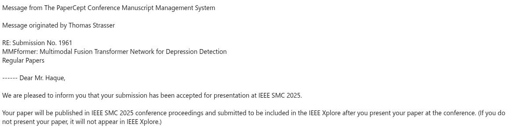

<h3>IEEE SMC 2025 Conference Highlights</h3>

<article>

  

    <strong>🎉 Two Papers Accepted at IEEE SMC 2025</strong> 
    <em>✅ June 2025</em>  
    Additionally, I'm thrilled to share that two of our papers have been <strong>accepted</strong> for presentation at <a href="https://www.ieeesmc2025.org/" target="_blank">IEEE SMC 2025</a>, which will be held in <strong>Vienna, Austria</strong> from <strong>October 5 – 8, 2025</strong>. 🎉  
    <strong>(1) MDD-Net: Multimodal Depression Detection through Mutual Transformer</strong>
    (<a href="../assets/img/MDD-Net_752.png" target="_blank" class="image-tooltip">Paper ID: 752</a>)  
    <strong>(2) MMFformer: Multimodal Fusion Transformer Network for Depression Detection</strong>
    (<a href="../assets/img/MMFformer_1961.png" target="_blank" class="image-tooltip">Paper ID: 1961</a>)  
    <!-- <strong>(1) MDD-Net: Multimodal Depression Detection through Mutual Transformer</strong> (Paper ID: 752) 
     
    <strong>(2) MMFformer: Multimodal Fusion Transformer Network for Depression Detection</strong> (Paper ID: 1961) 
       -->
    📌 <strong>Conference:</strong> 2025 IEEE International Conference on Systems, Man, and Cybernetics (SMC) 
    📍 <strong>Location:</strong> Austria Center Vienna, Austria 
    📅 <strong>Dates:</strong> October 5 – 8, 2025  
    Stay tuned for more updates — Looking forward to connecting with fellow researchers in Vienna!, Austria! 🇦🇹
  

</article>

