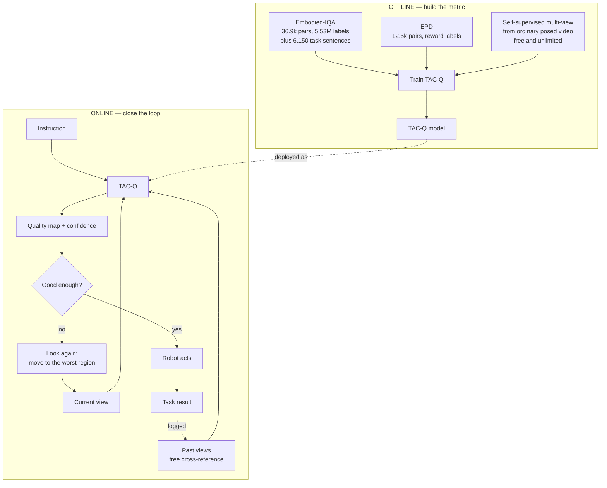

  <a href="{{ '/blog/world-models/' | relative_url }}">&larr; Blogs · <strong>World Models</strong> series</a>



This is the easy-reading version of my earlier deep review. That post has every table and every number. This one has the story, in plain words.

---

## The one idea

For fifty years we have measured picture quality by asking people. Does this photo look sharp? Does the compression look ugly? That question built the whole field of **Image Quality Assessment (IQA)**.

But today, most images are never seen by a person. A robot looks at them, and then it acts.

So the question changes. It is no longer *"does this image look good?"* It becomes *"can a robot still do its job with this image?"*

Those two questions have different answers. That gap is the whole research area.

> **The short version.** Two papers show that robots and humans disagree about image quality, and they build the databases to prove it. A third paper shows that a good quality score can be used to decide *where a robot should look next*. Nobody has combined the two. That combination is what I want to build.

---

## Glossary

Read this once and the rest of the post becomes easy.

| Short form | Full name | What it means here |
|---|---|---|
| **IQA** | Image Quality Assessment | Giving an image a quality score |
| **HVS** | Human Visual System | How people judge an image |
| **MVS** | Machine Visual System | How a normal computer-vision model judges it |
| **RVS** | Robot Visual System | How a robot judges it — because a robot must also *move* |
| **VLM** | Vision-Language Model | Looks at an image and writes text. The "understanding" part |
| **VLA** | Vision-Language-Action model | Looks at an image and outputs a robot movement. The "deciding" part |
| **RL** | Reinforcement Learning | Learning by trial, reward, and error |
| **FR-IQA** | Full-Reference IQA | Scoring needs a clean original to compare against |
| **NR-IQA** | No-Reference IQA | Scoring with no original at all |
| **CR-IQA** | Cross-Reference IQA | Scoring by comparing with *other views of the same scene* |
| **NVS** | Novel View Synthesis | Making a new photo of a scene from an angle you never photographed |
| **3DGS** | 3D Gaussian Splatting | A fast, popular way to store a 3D scene |
| **SRCC / PLCC / KRCC** | Spearman / Pearson / Kendall correlation | How closely a metric agrees with the truth. 1.0 is perfect, 0 is useless |
| **DoF** | Degrees of Freedom | How many numbers describe a robot arm's pose. Usually 7 |
| **MOS / DMOS** | (Difference) Mean Opinion Score | The average quality rating for an image |

One rule of thumb for the numbers below: on normal human-facing IQA, good metrics reach about **SRCC 0.9**. Keep that in mind, because the robot numbers are much lower.

---

## Part 1 — The two main papers

### Paper 1 · Image Quality Assessment for Embodied AI (*Embodied-IQA*)

*Shanghai Jiao Tong University, Shanghai AI Lab, and NTU · October 2025*

- **The problem.** A robot has three steps after it sees something: it must *understand* the scene, then *decide* a movement, then *execute* that movement. A tiny mistake in understanding can become a large mistake in movement, so the authors argue that quality must be measured at all three steps, not just the first one.
- **The data.** They took 1,230 clean robot photos, damaged them in 30 different ways at 5 strength levels to make **36,900 damaged images**, asked people to write 5 tasks for each photo in plain English, and then let **15 VLMs, 15 VLAs, and one real UR5 robot arm** score them — about **5.53 million labels** in total.
- **The method.** There is no new neural network here. The contribution is the *recipe*: measure understanding by comparing the model's sentences before and after damage, measure decision by comparing the 7-DoF arm poses, and measure execution by how far the real arm ended up from where it should have been.
- **The result.** The best existing metric reached only **SRCC 0.775**, far below the 0.9 that the same metrics get on human data — and some popular metrics (LPIPS, DISTS, CLIPIQA) scored *worse than plain PSNR*, because their weights are frozen on human taste.

**What stayed with me.** Damage level and damage effect are not the same thing. A very light block-loss that happens to erase the target object dropped the score to 2.98. A very heavy distortion somewhere else in the image still scored 4.52. The robot only cares about the part of the image it needs.

### Paper 2 · Embodied Image Quality Assessment for Robotic Intelligence (*EPD* and *MA-EIQA*)

*Same research family, earlier and smaller · August 2025*

- **The problem.** Ask whether robots and humans simply want different things from an image, and then build a quality database that is scored **by a robot doing a task, with no human involved at all**.
- **The data.** In a simulator, a robot arm tried two jobs — push a box and pick a box — across 100 starting scenes, with 25 kinds of damage at 5 levels, giving **12,500 image pairs**. The clever part: the image's quality score is simply **how much reward the robot earned in that episode**.
- **The method.** They built **MA-EIQA**, a small no-reference model. It reads an image at several zoom levels at once, then uses attention to focus on the regions that matter, then outputs one number. It was deliberately kept small (48.83 million parameters) so it can run on a robot's own limited hardware.
- **The result.** Their model reached **SRCC 0.5755**, slightly ahead of much larger models, but still low. More importantly, human and robot opinions barely agreed at all — **PLCC of only 0.13 to 0.21**.

**What stayed with me.** The ranking of what hurts. Motion blur and noise, which people hate, barely disturbed the robot. Colour distortion and darkening, which people tolerate easily, were the most damaging. Our instincts about "bad images" are simply not the robot's instincts.

### Paper 3 · Active View Selector (*AVS*)

*Oxford, Active Vision Lab and VGG · June 2025 · this one uses quality to act*

- **The problem.** When a robot builds a 3D model of a room, it must choose where to point the camera next. Older methods calculate uncertainty inside the 3D model, which is slow and must be rewritten for every kind of 3D representation.
- **The data.** No human labelling. They fit 3D scenes to hundreds of ordinary videos, and every so often compared a rendered view against the real photo. Those automatic comparisons became the training data.
- **The method.** A small network looks at a rendered view *together with a few real photos of the same scene from other angles* — this is **CR-IQA** — and predicts where the render looks wrong. Then the rule is simply: **go to the view that looks worst.** They call it "boost where it struggles".
- **The result.** Better 3D reconstructions than the previous best method, while running **14 to 33 times faster** and using half the memory — about 0.6 seconds to check roughly 200 candidate viewpoints.

**What stayed with me.** Two things. First, the trick of using *other viewpoints* as a stand-in for the missing original — for a robot this is free, because it already has its own earlier frames. Second, speed is not the obstacle. This runs comfortably inside a control loop.

---

## Part 2 — Recent related work

Short versions. Full details are in the deep review.

- **MPD** (CVPR 2025) — the same group's earlier database. 30,000 damaged images scored by 15 large multimodal models and 15 specialist models across 7 tasks. Its most useful finding: different downstream tasks *disagree with each other*, so one model is never enough as a judge.
- **MIQD-2.5M and RA-MIQA** (2025) — a completely different group reached the same conclusion with 2.5 million images and 75 models. Two independent confirmations means the premise is solid. They also score quality **per region** rather than for the whole image, which is a direction I like.
- **CrossScore** (ECCV 2024) — the paper that introduced cross-referencing as a new category of IQA, alongside full-reference and no-reference. This is the engine inside AVS.
- **TVVE** (2025-26) — teaches a robot to pick task-relevant camera viewpoints, so the target object and the gripper are both visible. It proves that conditioning on the task helps, but it never produces a quality score.
- **RobustVLA** (ICLR 2026) — tests robot policies under 17 kinds of disturbance. Key finding: making a policy robust to *visual* noise does **not** make it robust to anything else.
- **World-in-World** (2025) — judges world models by whether an agent actually succeeds, not by how pretty the predicted video is. Their headline: **good visuals do not guarantee good task performance.** This is strong outside support for everything above.

---

## Part 3 — What is still missing

Seven gaps. These are the openings.

| | Gap | Why it matters |
|---|---|---|
| **1** | **No metric knows the task.** | The same photo is excellent for "push the board" and useless for "pick up the small red block". Embodied-IQA *collects* 6,150 task sentences, then tests metrics that only look at pixels. The labels exist and nobody uses them. |
| **2** | **The score is one number, not a map.** | You cannot act on "0.43". You can act on "the left part of the view is unusable". |
| **3** | **Only one frame is ever scored.** | Blur and shake happen *over time*, and they are often caused by the robot's own movement. |
| **4** | **Metrics only diagnose, they never act.** | A score that just rejects an image is worth far less than one that says *move this way*. |
| **5** | **No confidence value.** | A robot needs a decision — act, look again, or stop. A bare number with no uncertainty cannot support that. |
| **6** | **The labels reward consistency, not correctness.** | Quality is measured as "did the model say the same thing before and after damage?" A model that is confidently wrong both times gets a perfect score. |
| **7** | **Nobody has measured the noise ceiling.** | This one is important, so it gets its own paragraph. |

**About gap 7.** In Embodied-IQA, the 15 robot models agree with each other at only about **SRCC 0.25**. Human rating panels usually agree at 0.6 or higher. So the "correct answer" is itself very noisy. The paper reports that the best metric reaches 0.775 and calls this insufficient — but if the maximum reachable score is, say, 0.80, then 0.775 is already near-perfect and there is nothing left to win. **Nobody has checked.** Measuring this is cheap, and the answer decides whether the whole field has room to grow.

---

## Part 4 — The metric I want to build

I am calling it **TAC-Q**, for *Task-Aware Cross-referenced Quality*.

The idea in one sentence: **given the instruction and the current view, produce a map showing where the robot has enough information to act, plus an honest confidence value.**

Four properties, each closing a gap. **No existing metric has more than two of them.**

| Property | Closes gap | Where the idea comes from |
|---|---|---|
| The instruction is fed into the model, so quality depends on the job | 1 | New — but the labels already exist in Embodied-IQA |
| Other viewpoints act as the missing reference — free, since the robot has its own past frames | the no-reference problem | CrossScore and AVS |
| Output is a map, so the worst region tells the robot where to move | 2 and 4 | AVS plus RA-MIQA |
| Trained on the *disagreement* among 15 robot models, not just their average | 5 | New — treat disagreement as information, not noise |

That last one is the part I like most. Everyone so far has averaged the 15 models together and treated their disagreement as annoying noise. But disagreement is exactly the signal you need: when the models disagree strongly about an image, that *is* the uncertainty, and a robot should look again.

---

## Part 5 — The plan

Two loops. The offline loop builds the metric. The online loop proves it is useful.

### The stages

**Stage 0 — Check the ceiling first.** *(about 4 weeks)*
Before building anything, measure how much room there actually is. Split the 15 robot models into two halves, check how well one half predicts the other, and use that to estimate the highest score any metric could reach. If the answer is that current metrics are already near the limit, I save myself a year. This is cheap, needs no training, and is worth writing up on its own.

**Stage 1 — Gather the data.** *(about 6 weeks)*
Embodied-IQA and EPD are released. The third source is the interesting one: following the AVS recipe, I can generate unlimited training pairs from ordinary videos with known camera positions, with no labelling and no robot lab. That is what makes this affordable.

**Stage 2 — Build the model.** *(about 10 weeks)*
A light image backbone, a cross-attention layer that compares the current view against past views, the instruction fed in as text, and two outputs: a quality map and a confidence value. One important choice — train it to get the *ranking* right rather than the exact number, because with labels this noisy, exact values are meaningless but order is not.

**Stage 3 — Test it properly.** *(about 6 weeks)*
Compare against the existing metrics, but add three tests nobody currently runs: results reported as a *percentage of the ceiling* from Stage 0; results broken down *by task difficulty*; and results on *robot models never seen during training*.

**Stage 4 — Close the loop.** *(about 10 weeks)*
This is what makes it more than another metric paper. Three versions, from safest to most ambitious: let the robot look again when confidence is low; use the quality map to choose the next viewpoint; and finally use quality as a training reward so the robot learns to position itself well. The last one connects directly to my "moving to see better" idea.

**Stage 5 — Real robot.** *(about 8 weeks)*
A UR5 arm, which is what both main papers used, so the numbers are directly comparable. Kept small on purpose — a few hundred trials for checking, never for bulk training.

*(Timings assume one person with GPU access, and the stages overlap.)*

### What comes out of it

| | Paper | The claim |
|---|---|---|
| **P0** | The ceiling study | The field is comparing against very noisy answers without knowing it |
| **P1** | TAC-Q | The first quality metric that knows the task, produces a map, and reports confidence |
| **P2** | Closing the loop | A quality metric that measurably raises task success, not just correlation |

The order matters. P0 is cheap and buys credibility. P1 gives P2 its instrument.

---

## Why this is the right moment

- **Scores are low everywhere.** The best results are 0.775 and 0.576. There is room.
- **There is a venue waiting.** The Machine-oriented IQA (MoIQA) Challenge at ACM Multimedia 2026 has exactly two tracks: match VLM behaviour in simulation, and match VLA behaviour in the real world. It comes with data and an evaluation protocol I do not have to defend.
- **Two independent groups agree.** Different labs, different data, same conclusion. The premise is not one lab's opinion.
- **Speed is not the blocker.** AVS already runs inside a control loop.

## The first two weeks

1. Download the Embodied-IQA release and see what is actually public.
2. Reproduce one published number, to confirm the setup works.
3. Compute the agreement between the robot models — **the single most informative experiment available right now.**
4. Read the CrossScore paper properly. It is the most reusable piece of the whole plan.
5. Check the MoIQA challenge deadlines.

---

## Closing thought

The most useful sentence I read across all of these papers was not about a network or a dataset. It was the observation, repeated in three separate places, that **a picture looking good and a picture being useful are different things.**

We have spent decades getting very good at the first one. The second one is nearly untouched. And for a robot, only the second one matters.

If you are working on something nearby, I would genuinely like to hear about it.



  <a href="{{ '/blog/world-models/' | relative_url }}">&larr; Back to the <strong>World Models</strong> series</a>

